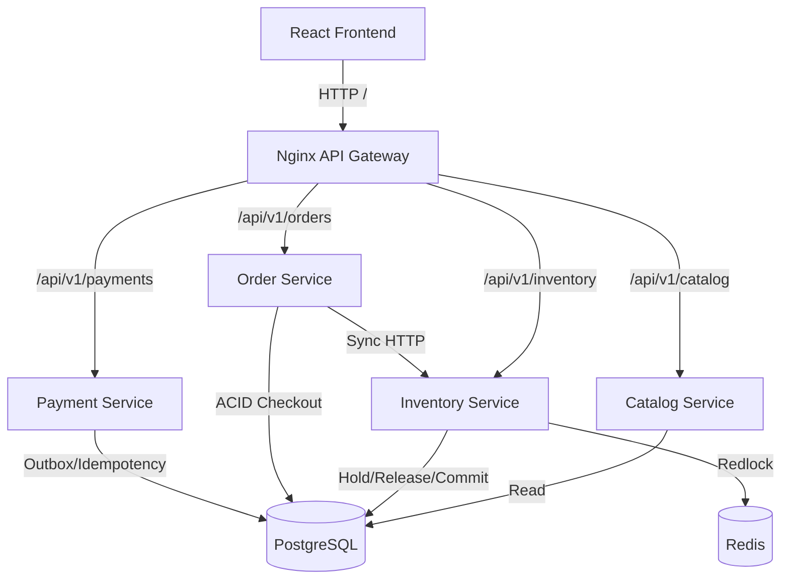

# 1. Architecture Overview

Welcome to the ULTRON Store documentation. This system is a highly scalable, distributed e-commerce platform built using modern microservices, React, and an API Gateway.

## High-Level Architecture Diagram

## Core Components

### 1. Frontend Store (`services/frontend-store`)
A React-based SPA built with Vite, Tailwind CSS, and Lucide Icons.
- **Standalone Mode:** Can function entirely in-memory if the backend is down.
- **Live Mode:** Polls the API Gateway for real-time stock updates. Interacts with the `inventory-service` to hold stock dynamically via Redis locks.

### 2. Nginx API Gateway (`services/gateway`)
The single entry point into the system.
- Reverses proxies traffic to `frontend-store` on `/`.
- Routes microservice traffic via `/api/v1/*` endpoints.

### 3. Microservices Fleet (Node.js)
- **Catalog Service:** Serves product metadata and specifications. Auto-seeds the database on boot.
- **Inventory Service:** Manages real-time stock status. Upgrades states from `AVAILABLE` to `LOCKED_CHECKOUT_HOLD` and finally to `SOLD`. 
- **Order Service:** Orchestrates multi-step checkouts. Guarantees that carts are transformed into orders only if inventory confirms the stock lock.
- **Payment Service:** Simulates external gateway charges. Highly robust—implements deep idempotency to prevent double-charges and uses a Transactional Outbox pattern for reliable event publishing.
